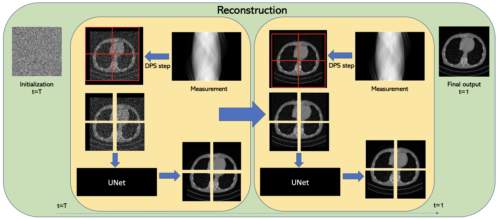

# PaDIS-LION-Compat

PaDIS-LION-Compat is a fork of the original
[PaDIS repository](https://github.com/jasonhu4/PaDIS) by Hu et al. It integrates
checkpoints trained by the main [LION](https://github.com/CambridgeCIA/LION)
PaDIS implementation with the original PaDIS reconstruction code. Its purpose
is compatibility testing: the same LION-trained PaDIS/NCSN++ prior can be run
through Hu et al.'s public sampler, preprocessing, and CT reconstruction path
for direct implementation comparisons.

The original PaDIS project and paper remain the source of the method. The
compatibility additions in this fork are concentrated in:

- `lion_checkpoint.py`, which loads a LION `.pt` checkpoint (and its `.json`
  sidecar when available) and exposes it through the denoiser interface expected
  by the original PaDIS sampler;
- `prepare_lidc_pngs.py`, which exports LIDC-IDRI slices using LION's split,
  resizing, and HU normalisation; and
- the extended `inverse_nodist.py`, which accepts LION checkpoints and provides
  diagnostic sampler and LION-geometry options while retaining the original
  README reconstruction path as the default.

## Using PaDIS-LION-Compat with LION

Install the main LION repository and this fork in sibling directories. Use a
Python environment containing the dependencies from both LION and this fork;
the repository's development setup uses the `padis-dev` Conda environment.
The examples below assume this layout:

```text
project/
├── LION/
└── PaDIS_lion_recon/
```

LION checkpoints used by this fork should normally consist of the model file
and its metadata sidecar in the same directory:

```text
padis_lidc_256.pt
padis_lidc_256.json
```

The sidecar lets the adapter recover the trained image size, patch size,
padding, channel count, model parameters, and geometry. If it is absent, the
loader falls back to the LION PaDIS LIDC 256 defaults. EMA weights embedded in
the checkpoint, or stored in a neighbouring `.ema.pt` file, are used when
available.

### 1. Export LIDC-IDRI images with LION preprocessing

From `PaDIS_lion_recon`, convert a LION test split to the PNG input expected by
the public PaDIS script:

```bash
conda run -n padis-dev env PYTHONPATH=../LION \
  python prepare_lidc_pngs.py \
  --lion-repo ../LION \
  --split test \
  --input-root /path/to/LION_DATA_PATH/processed/LIDC-IDRI \
  --output-dir /path/to/LIDC-IDRI-padis-png-256 \
  --image-size 256
```

This follows LION's `LIDC_IDRI(..., task="image_prior")` data path: HU slices
are resized with bilinear interpolation (`align_corners=False`) and mapped to
`[0, 1]` as `(HU + 1000) / 3000`, with clipping. Add `--limit 1` for a quick
setup check. Match `--image-size` to the checkpoint (for example, use `512` for
a 512 checkpoint).

### 2. Reconstruct with a LION checkpoint

Run the original PaDIS DPS reconstruction, replacing the example paths with
the checkpoint produced by LION and the exported PNG directory:

```bash
conda run --no-capture-output -n padis-dev env PYTHONPATH=../LION \
  MPLCONFIGDIR=/tmp/padis-mpl XDG_CACHE_HOME=/tmp/padis-xdg \
  python inverse_nodist.py \
  --network /path/to/padis_lidc_256.pt \
  --lion_repo ../LION \
  --device cuda \
  --ct_impl astra_cuda \
  --image_dir /path/to/LIDC-IDRI-padis-png-256 \
  --outdir /path/to/results \
  --name ct_parbeam \
  --views 20 \
  --steps 100 \
  --sigma_min 0.003 \
  --sigma_max 10 \
  --zeta 0.3 \
  --sigma 0 \
  --max_images 1
```

`ct_parbeam` and the default `dps` sampler are the closest compatibility check
against the command in the upstream README. Use `--name ct_lion_fanbeam` or
`--name ct_lion_parbeam` when the comparison specifically requires LION-scale
geometry. The fork also exposes `pc`, `langevin`, `ddnm`, `patch_average`, and
`patch_stitch` through `--sampler` for diagnostics.

On memory-constrained GPUs, add `--patch_batch_size 1`. DPS and the fixed-patch
variants differentiate through the denoiser for data consistency; add
`--checkpoint_denoiser` if they still exceed available memory. CPU execution is
available with `--device cpu --ct_impl astra_cpu`, but is intended only for
short setup checks.

Each run writes reconstruction PNGs and `reconstructions.npz`, containing the
clean images, reconstructions, PSNR, SSIM, and input filenames. See
[`RUN_LION_LIDC.md`](./RUN_LION_LIDC.md) for the complete option reference,
validated 256/512 examples, LION-geometry comparisons, tracing, and sampler
diagnostics. For training checkpoints and running the full experiment matrix,
use the PaDIS reproduction pipeline documented in the main LION repository at
`scripts/paper_scripts/PaDIS-Reproduction/README.md`.

---

## Original PaDIS README

The remainder of this file retains the original upstream project description
and usage instructions.

## Learning Image Priors through Patch-based Diffusion Models for Solving Inverse Problems<br><sub>Official PyTorch implementation</sub>

Our work has been accepted to [Neurips 2024](https://nips.cc/virtual/2024/poster/95843). 



**Learning Image Priors through Patch-based Diffusion Models for Solving Inverse Problems**<br>
Jason Hu, Bowen Song, Xiaojian Xu, Liyue Shen, Jeffrey A. Fessler
<br>https://arxiv.org/abs/2406.02462 <br>

Abstract: *Diffusion models can learn strong image priors from underlying data distribution and use them to solve inverse problems, but the training process is computationally expensive and requires lots of data. Such bottlenecks prevent most existing works from being feasible for high-dimensional and high-resolution data such as 3D images. This paper proposes a method to learn an efficient data prior for the entire image by training diffusion models only on patches of images. Specifically, we propose a patch-based position-aware diffusion inverse solver, called PaDIS, where we obtain the score function of the whole image through scores of patches and their positional encoding and utilize this as the prior for solving inverse problems. First of all, we show that this diffusion model achieves an improved memory efficiency and data efficiency while still maintaining the capability to generate entire images via positional encoding. Additionally, the proposed PaDIS model is highly flexible and can be plugged in with different diffusion inverse solvers (DIS). We demonstrate that the proposed PaDIS approach enables solving various inverse problems in both natural and medical image domains, including CT reconstruction, deblurring, and superresolution, given only patch-based priors. Notably, PaDIS outperforms previous DIS methods trained on entire image priors in the case of limited training data, demonstrating the data efficiency of our proposed approach by learning patch-based prior.*


## Requirements
* Python libraries: See [environment.yml](./environment.yml) for exact library dependencies.
* Also see [odl_env.yml](./odlstuff/odl_env.yml) for help on installing ODL package for running CT experiments.

## Getting started
First, create a folder called `training-runs` in the base directory. This will be where checkpoints are stored.

*Please note that training and reconstruction of colored images is currently not supported but will be updated soon. Thanks for your patience!*

### Preparing datasets
The simplest way to use a custom dataset is to use a mat file. As specified on line 81 of [training_loop.py](./training/training_loop.py), the mat file should have a variable called 'images' storing all the grayscale images in a single 3D array. The first two dimensions should be the image size, and the third dimension should be the number of total training images. For larger datasets and other ways to process data, see [dataset.py](./training/dataset.py) for alternate data loader options.

### Train Patch Diffusion

You can train new models using `train.py`. For example:

```.bash
# Train DDPM++ model using 4 GPUs with batch size of 16
torchrun --standalone --nproc_per_node=4 train.py --outdir=training-runs --data=mydata --cond=0 --arch=ddpmpp --batch=16 --lr=1e-4 --dropout=0.05 --augment=0 --real_p=0.5 --padding=1 --tick=2 --snap=10 --pad_width=64

```

Please see [train.py](./train.py) for more information on the hyperparameters.

### Image Reconstruction

After the checkpoint has been trained, perform image reconstruction with `inverse_nodist.py`. Create a new directory called image_dir containing png files consisting of the testing dataset; the reconstruction algorithm will be run on all images inside this directory. For example:
```.bash
# Perform 20 view CT reconstruction
python3 inverse_nodist.py --network=training-runs/67-ctaxial/network-snapshot-000800.pkl --outdir=results --image_dir=image_dir --image_size=256 --views=20 --name=ct_parbeam --steps=100 --sigma_min=0.003 --sigma_max=10 --zeta=0.3 --pad=24 --psize=56

```

Here is one checkpoint for [CT images](https://drive.google.com/file/d/1fJOcqnOw3EFPKj9vX_hdGvB8r-Oz4_yJ/view?usp=sharing).

## Citation

```
@article{hu2024padis,
  title={Learning Image Priors through Patch-based Diffusion Models for Solving Inverse Problems},
  author={Hu, Jason and Song, Bowen and Xu, Xiaojian and Shen, Liyue and Fessler, Jeffrey A.},
  journal={arXiv preprint arXiv:2406.02462},
  year={2024}
}
```

## Acknowledgments

We thank the [Patch-Diffusion](https://github.com/Zhendong-Wang/Patch-Diffusion) authors for providing a great code base.
